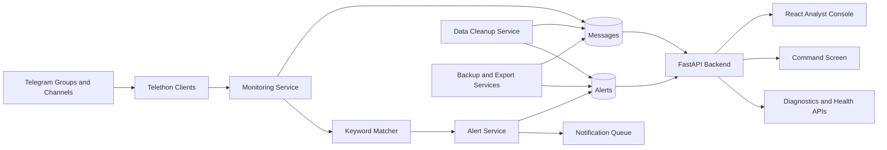

<p align="center">
  <a href="./README.zh-CN.md">Read this README in Chinese</a>
</p>

<p align="center">
  
</p>

<p align="center">
  
  
  
  
  
</p>

# Tingfeng Zhuiying

**Tingfeng Zhuiying** is a cyberpunk-style Telegram monitoring, keyword intelligence, alert triage, analytics, and command-screen system. It is designed for teams that need to collect high-volume Telegram group/channel activity, match configurable keyword rules in real time, turn matches into structured alerts, and present operational intelligence through dashboards and large-screen visualizations.

The repository contains the synchronized production codebase without runtime data. Databases, logs, Telegram session files, exported files, backup packages, uploaded files, and real secrets are intentionally excluded.

## Screenshots

The screenshots below are captured from a live deployment and redacted before being committed. Exact message content, sensitive object names, live timestamps, and selected metrics are hidden while preserving the interface layout and visual style.

### Analytics Dashboard


### Command Screen


### Alert Workbench


## What It Solves

Telegram monitoring often fails in the same places: real-time capture works, but alerts are late or incomplete; keyword rules become hard to maintain; dashboards show raw counts but not operational context; storage grows without a predictable budget; and large-screen views look impressive but do not help decision makers understand risk.

This project addresses those issues as one system:

- **Real-time message ingestion** from Telegram groups, channels, and public conversations.
- **Configurable keyword intelligence** with keyword groups, match levels, message context, and alert aggregation.
- **Alert lifecycle management** for pending, handled, ignored, and historical alerts.
- **Operational dashboards** for analysts who need drill-down, ranking, trend, heat, and health views.
- **Large-screen command visualization** for leadership briefings and monitoring rooms.
- **Storage governance** based on record-count and capacity budgets instead of only time-based retention.
- **Deployment and recovery tooling** for repeatable installation, service management, health checks, and backup workflows.

## Core Capabilities

| Area | Capability |
| --- | --- |
| Telegram collection | Multi-account monitoring, session management, connection state tracking, new-message handling, edited-message handling, conversation synchronization |
| Keyword engine | Keyword groups, level mapping, category tagging, phrase matching, sender/conversation context, alert deduplication support |
| Alert center | Search, filters, severity levels, pending state, batch operations, CSV export, alert stream display, alert diagnostics |
| Dashboard | 24-hour message trend, alert distribution, keyword heat, word cloud, high-risk object ranking, conversation activity, system health |
| Command screen | Leadership-friendly KPI cards, animated numbers, message trend, alert composition, runtime health, alert feed, responsive scaling |
| Data governance | Message and alert count limits, database capacity budget, cleanup service, backup/export/import utilities |
| Operations | systemd units, install scripts, restart scripts, health check script, watchdog script, log rotation config |
| Security posture | Environment templates, secret exclusion rules, protected branch workflow, CODEOWNERS, CI checks |

## Architecture



## Frontend Modules

The frontend is a React + TypeScript + Vite application with a dark, glass, neon command-center style. It is optimized for both daily analyst work and large-screen display.

| Page | Purpose |
| --- | --- |
| Dashboard | Main analyst overview with trends, alert structure, keyword heat, word cloud, rankings, and health status |
| Real-time Monitoring | Live message and monitoring state view |
| Alert Center | Alert search, filtering, triage, handling, and CSV export |
| Proxy Management | Proxy configuration and runtime proxy status |
| Keyword Management | Keyword groups, categories, levels, and rule maintenance |
| Conversation Management | Telegram group/channel/session conversation management |
| Notification Configuration | Notification channels, queue status, and delivery configuration |
| Account Management | Telegram account/client management |
| System Settings | Retention, storage, cleanup, and operational settings |
| Command Screen | Large-screen, leadership-friendly monitoring wall |

## Backend Modules

The backend is a FastAPI application organized around API routers, SQLAlchemy models, Pydantic schemas, and service modules.

```text
backend/
├── app/api/              # REST API routers
├── app/core/             # configuration and database bootstrap
├── app/models/           # SQLAlchemy entities
├── app/schemas/          # Pydantic request/response models
├── app/services/         # alert, cleanup, backup, export, notification and report services
├── app/telegram/         # Telethon client and monitoring pipeline
└── init_db.py            # database initialization helper
```

Important service areas:

- `alert_service.py` creates and aggregates alerts from keyword matches.
- `keyword_matcher.py` centralizes matching behavior and category/level mapping.
- `data_cleanup_service.py` enforces record-count and storage-capacity retention policies.
- `notification_service.py` handles notification delivery and queue state.
- `backup_service.py`, `export_service.py`, and `import_service.py` support operational recovery and data movement.
- `wordcloud_service.py`, `sentiment_service.py`, and `report_service.py` support analytics views.

## Data Retention Strategy

The system is designed to avoid uncontrolled database growth. Instead of relying only on “keep N days,” retention is governed by record-count limits and a total storage budget.

Recommended policy:

- Message data is retained by maximum record count and database capacity.
- Alert data is retained by maximum alert count and operational usefulness.
- Cleanup runs periodically and deletes the oldest records beyond the configured limits.
- The deployment target should keep the monitored database below the configured capacity budget, with the current production recommendation staying under **900 GB**.

The exact record limits should be tuned to the deployment’s message volume, alert density, disk capacity, and query performance requirements.

## Security Model

This repository deliberately excludes runtime secrets and private operational data.

Never commit:

- `.env` files.
- Telegram API ID/API hash values.
- JWT secret keys.
- SMTP, webhook, proxy, or database passwords.
- Telegram session files such as `*.session`.
- Logs, exports, backups, database files, uploaded files, or raw screenshots containing real message content.

The repository includes:

- `.env.example`, `backend/.env.example`, and `frontend/.env.example`.
- `.gitignore` rules for runtime data and build artifacts.
- `SECURITY.md` with reporting and handling guidance.
- `CODEOWNERS` so repository ownership review can be enforced.
- GitHub Actions CI for backend syntax checks and frontend production builds.
- Protected `main` branch policy requiring pull requests, review, and status checks.

## Repository Layout

```text
.
├── .github/
│   ├── CODEOWNERS
│   ├── pull_request_template.md
│   └── workflows/ci.yml
├── backend/
├── frontend/
├── docs/assets/
├── install.sh
├── install-services.sh
├── monitorctl.sh
├── service.sh
├── start.sh
├── health-check.sh
├── health-check-cron.sh
├── tg_watchdog.py
├── tg-monitor-backend.service
├── tg-monitor-frontend.service
├── DEPLOYMENT.md
├── CONTRIBUTING.md
└── SECURITY.md
```

## Quick Deployment

Recommended operating systems:

- Ubuntu 22.04 LTS
- Ubuntu 24.04 LTS
- Debian 12

Clone the repository:

```bash
git clone https://github.com/chu0119/tg-monitor-v2.git
cd tg-monitor-v2
```

Create configuration:

```bash
cp .env.example .env
vim .env
```

Run the installer:

```bash
bash install.sh
```

Typical endpoints after deployment:

| Service | URL |
| --- | --- |
| Frontend | `http://SERVER_IP:3000` |
| Backend API | `http://SERVER_IP:8000/api/v1` |
| Health check | `http://SERVER_IP:8000/health` |

For a fuller deployment, migration, rollback, and backup guide, read [DEPLOYMENT.md](./DEPLOYMENT.md).

## Required Configuration

At minimum, configure database credentials, Telegram API credentials, and a long random JWT secret.

```env
MYSQL_HOST=localhost
MYSQL_PORT=3306
MYSQL_USER=tgmonitor
MYSQL_PASSWORD=change_me
MYSQL_DATABASE=tg_monitor

TELEGRAM_API_ID=123456
TELEGRAM_API_HASH=change_me

JWT_SECRET_KEY=change_me_to_a_long_random_value
```

Telegram API credentials can be created from the Telegram developer portal.

## Local Development

Backend:

```bash
cd backend
python3 -m venv venv
source venv/bin/activate
pip install -r requirements.txt
cp .env.example .env
python init_db.py
uvicorn app.main:app --host 0.0.0.0 --port 8000 --reload
```

Frontend:

```bash
cd frontend
npm ci
npm run dev -- --host 0.0.0.0 --port 5173
```

Production frontend build:

```bash
cd frontend
npm ci
npm run build
```

## Operations

Common commands:

```bash
./monitorctl.sh status
./monitorctl.sh start
./monitorctl.sh stop
./monitorctl.sh restart
./monitorctl.sh logs
./health-check.sh
```

Service templates:

- `tg-monitor-backend.service`
- `tg-monitor-frontend.service`

Operational helpers:

- `auto-restart.sh` for restart automation.
- `health-check-cron.sh` for scheduled health checks.
- `tg_watchdog.py` for process-level watchdog behavior.
- `logrotate.conf` for log retention.

## Recent Production Updates

- Fixed alert statistics and ranking mismatches when real-time messages were being captured correctly but alert views looked sparse or inconsistent.
- Reworked high-risk object ranking so alert counts are aggregated from real alert data.
- Expanded the dashboard with word cloud, keyword heat, system health, object ranking, conversation activity, and alert feed sections.
- Improved command-screen layout, animation, refresh cadence, responsive scaling, and leadership-facing information density.
- Changed data cleanup from day-only retention to record-count and storage-budget retention.
- Added alert-chain diagnostics, notification queue visibility, and masked sensitive configuration responses.
- Added GitHub repository governance, branch protection, CODEOWNERS review, and CI verification.
- Patched vulnerable frontend and backend dependencies.

## CI and Branch Protection

The default branch is protected. Changes should be merged through pull requests.

Current expectations:

- Pull request required before merging.
- At least one approval required.
- CODEOWNERS review required.
- Stale approvals are dismissed after new commits.
- Required status check: `build-and-check`.
- Force push and branch deletion are disabled.

The CI workflow performs:

- Python dependency installation.
- Backend syntax compilation.
- Node dependency installation.
- Frontend production build.

## Roadmap Ideas

Potential next improvements:

- Add backend unit tests for keyword matching, alert aggregation, and cleanup limits.
- Add frontend smoke tests for core pages and command-screen rendering.
- Add database migration validation in CI.
- Add optional Docker Compose deployment profile.
- Add role-based access control for analyst, maintainer, and viewer roles.
- Add structured audit logs for configuration changes and alert handling actions.
- Add more configurable command-screen themes for different display rooms.

## License

No open-source license is currently declared. Without explicit permission from the repository owner, redistribution, commercial reuse, and derivative publication are not granted.
