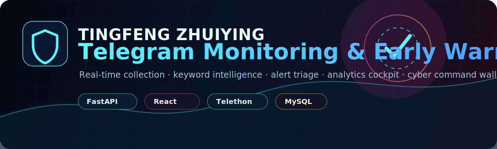
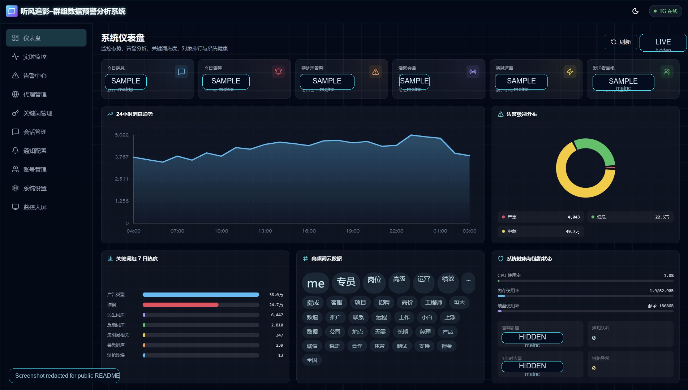
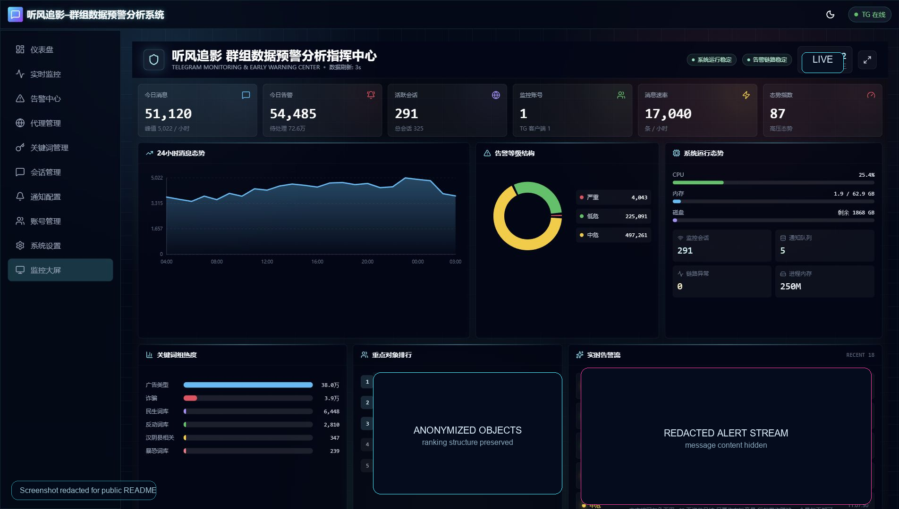
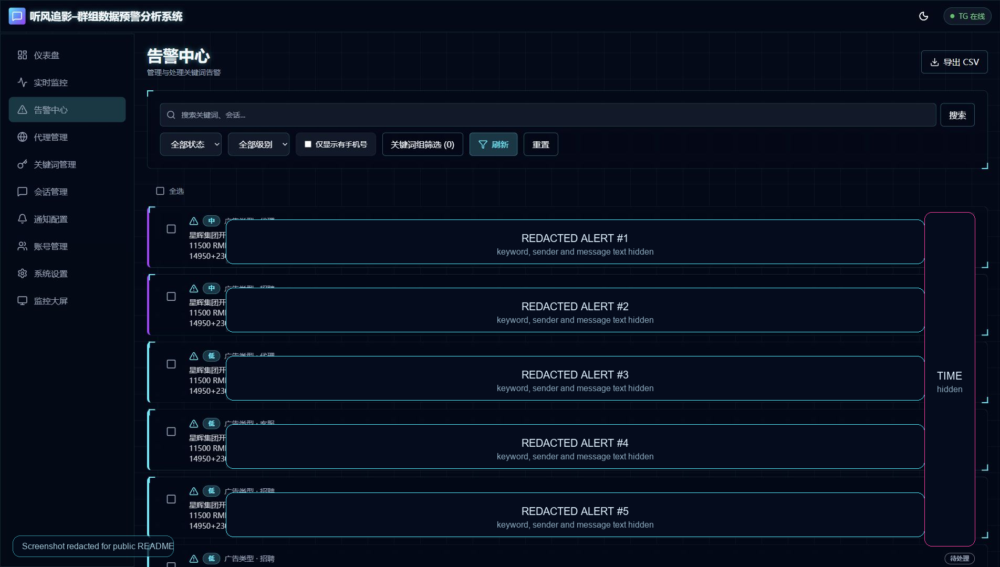
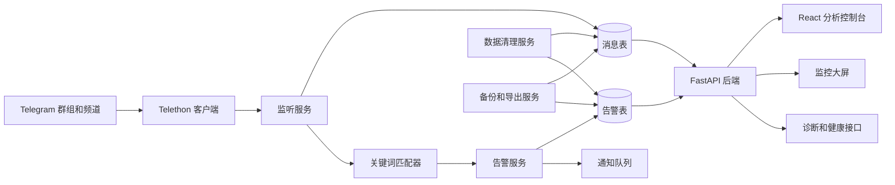

<p align="center">
  <a href="./README.md">English README</a>
</p>

<p align="center">
  
</p>

<p align="center">
  
  
  
  
  
</p>

# 听风追影

**听风追影** 是一套偏赛博朋克视觉风格的 Telegram 群组数据监控、关键词情报、告警研判、数据分析和大屏展示系统。它面向需要长期监测 Telegram 群组、频道、公开会话和重点对象的使用场景，能够把海量实时消息转换成可检索、可分析、可告警、可展示的结构化数据。

当前仓库已经同步生产环境稳定代码，但不包含运行数据。数据库、日志、Telegram session、导出文件、备份包、上传文件和真实密钥均已排除。

## 界面预览

以下截图来自实际部署环境，并在提交前完成脱敏处理。真实消息内容、敏感对象名、精确实时钟、部分业务指标已隐藏，但界面结构、功能布局和视觉风格保持不变。

### 数据仪表盘



### 监控大屏



### 告警中心



## 解决什么问题

Telegram 监控系统常见问题不是“收不到消息”这么简单，而是消息量上来以后，告警链路、关键词规则、统计口径、清理策略和展示体验都会一起变复杂：

- 实时消息能抓到，但告警生成、统计、排行不一定准确。
- 关键词越配越多，分类、等级、命中率和误报治理越来越难维护。
- 仪表盘只有简单数字，不足以支撑分析人员定位问题。
- 大屏如果只是堆数据，领导看起来不直观，也缺少展示效果。
- 数据只按时间删除时，无法很好控制数据库容量和查询性能。
- 运维脚本、备份、回退、健康检查如果不成体系，后续迁移和部署风险会很高。

这套系统把采集、匹配、告警、分析、展示、清理、部署和治理串成一条完整链路。

## 核心能力

| 模块 | 能力 |
| --- | --- |
| Telegram 采集 | 多账号监听、会话管理、连接状态追踪、新消息处理、编辑消息处理、历史会话同步 |
| 关键词引擎 | 关键词组、分类标签、风险等级、短语匹配、上下文记录、告警去重与聚合基础 |
| 告警中心 | 搜索、筛选、等级过滤、待处理状态、批量操作、CSV 导出、告警流、链路诊断 |
| 数据仪表盘 | 24 小时趋势、告警分布、关键词热度、词云、高风险对象排行、会话活跃度、系统健康 |
| 监控大屏 | 面向领导展示的 KPI 卡片、数字滚动、趋势图、告警结构、运行态势、实时告警流、自适应缩放 |
| 数据治理 | 消息数量上限、告警数量上限、数据库容量预算、自动清理、备份、导出、导入 |
| 运维能力 | systemd 服务、一键安装、重启脚本、健康检查、看门狗、日志轮转 |
| 仓库治理 | 环境变量模板、敏感文件排除、分支保护、CODEOWNERS、CI 自动检查 |

## 系统架构



## 前端功能页

前端基于 React、TypeScript、Vite、Tailwind CSS 和 Recharts 构建，整体采用暗色玻璃质感和霓虹边缘的赛博控制台风格。日常使用侧重高信息密度、可检索、可筛选、可研判；大屏模式侧重视觉表现、核心指标和领导展示。

| 页面 | 说明 |
| --- | --- |
| 仪表盘 | 分析人员首页，展示趋势、分布、热度、词云、排行、会话活跃度和系统健康 |
| 实时监控 | 查看实时消息流和监听运行状态 |
| 告警中心 | 告警检索、筛选、处理、状态维护和 CSV 导出 |
| 代理管理 | 代理节点配置与运行状态维护 |
| 关键词管理 | 关键词组、分类、等级和规则维护 |
| 会话管理 | Telegram 群组、频道和会话对象管理 |
| 通知配置 | 通知渠道、通知队列和推送配置 |
| 账号管理 | Telegram 账号和客户端状态维护 |
| 系统设置 | 数据保留、容量预算、清理策略和系统配置 |
| 监控大屏 | 适配展示屏的态势感知页面 |

## 后端模块

后端是 FastAPI 应用，按 API、模型、Schema、服务和 Telegram 监听模块拆分。

```text
backend/
├── app/api/              # REST API 路由
├── app/core/             # 配置和数据库初始化
├── app/models/           # SQLAlchemy 数据模型
├── app/schemas/          # Pydantic 请求/响应模型
├── app/services/         # 告警、清理、备份、导出、通知、报表等业务服务
├── app/telegram/         # Telethon 客户端与监听流程
└── init_db.py            # 数据库初始化工具
```

重点服务说明：

- `alert_service.py`：根据关键词命中结果创建告警，并维护告警聚合逻辑。
- `keyword_matcher.py`：集中处理关键词匹配、分类和等级映射。
- `data_cleanup_service.py`：按记录数量和容量预算执行消息/告警清理。
- `notification_service.py`：处理通知投递和队列状态。
- `backup_service.py`、`export_service.py`、`import_service.py`：用于备份、导出、导入和迁移。
- `wordcloud_service.py`、`sentiment_service.py`、`report_service.py`：支撑词云、分析和报表能力。

## 数据存储和清理策略

系统不建议只按“保留多少天”来清理数据，因为 Telegram 消息量波动很大，同样的天数在不同阶段可能对应完全不同的数据量和数据库压力。

当前推荐策略：

- 实时消息按最大记录数和数据库容量预算保留。
- 告警数据按最大告警数和实际研判价值保留。
- 超出上限后，清理服务优先删除最旧数据。
- 部署目标建议将数据库控制在配置预算内，当前生产建议为不超过 **900GB**。

实际记录数应结合以下因素调整：

- 每日消息量。
- 关键词命中率。
- 告警处理周期。
- 磁盘容量。
- 查询性能。
- 是否需要长期留存用于复盘。

## 安全原则

仓库不提交任何运行密钥和私有数据。

不要提交：

- `.env` 文件。
- Telegram API ID/API Hash。
- JWT 密钥。
- SMTP、Webhook、代理或数据库密码。
- Telegram session 文件，例如 `*.session`。
- 日志、导出文件、备份包、数据库文件、上传文件。
- 未脱敏的真实系统截图。

仓库已经包含：

- `.env.example`、`backend/.env.example`、`frontend/.env.example`。
- 排除运行数据和构建产物的 `.gitignore`。
- `SECURITY.md` 安全说明。
- `CODEOWNERS` 审核规则。
- GitHub Actions CI。
- `main` 分支保护规则。

## 仓库结构

```text
.
├── .github/
│   ├── CODEOWNERS
│   ├── pull_request_template.md
│   └── workflows/ci.yml
├── backend/
├── frontend/
├── docs/assets/
├── install.sh
├── install-services.sh
├── monitorctl.sh
├── service.sh
├── start.sh
├── health-check.sh
├── health-check-cron.sh
├── tg_watchdog.py
├── tg-monitor-backend.service
├── tg-monitor-frontend.service
├── DEPLOYMENT.md
├── CONTRIBUTING.md
└── SECURITY.md
```

## 快速部署

推荐系统：

- Ubuntu 22.04 LTS
- Ubuntu 24.04 LTS
- Debian 12

克隆仓库：

```bash
git clone https://github.com/chu0119/tg-monitor-v2.git
cd tg-monitor-v2
```

创建配置：

```bash
cp .env.example .env
vim .env
```

执行安装：

```bash
bash install.sh
```

部署完成后的常见访问地址：

| 服务 | 地址 |
| --- | --- |
| 前端 | `http://服务器IP:3000` |
| 后端 API | `http://服务器IP:8000/api/v1` |
| 健康检查 | `http://服务器IP:8000/health` |

更完整的部署、迁移、回退和备份流程见 [DEPLOYMENT.md](./DEPLOYMENT.md)。

## 必填配置

至少需要配置数据库、Telegram API 凭证和一个足够长的 JWT 密钥。

```env
MYSQL_HOST=localhost
MYSQL_PORT=3306
MYSQL_USER=tgmonitor
MYSQL_PASSWORD=change_me
MYSQL_DATABASE=tg_monitor

TELEGRAM_API_ID=123456
TELEGRAM_API_HASH=change_me

JWT_SECRET_KEY=change_me_to_a_long_random_value
```

Telegram API 凭证可在 Telegram 开发者平台创建。

## 本地开发

后端：

```bash
cd backend
python3 -m venv venv
source venv/bin/activate
pip install -r requirements.txt
cp .env.example .env
python init_db.py
uvicorn app.main:app --host 0.0.0.0 --port 8000 --reload
```

前端：

```bash
cd frontend
npm ci
npm run dev -- --host 0.0.0.0 --port 5173
```

生产构建：

```bash
cd frontend
npm ci
npm run build
```

## 运维命令

常用命令：

```bash
./monitorctl.sh status
./monitorctl.sh start
./monitorctl.sh stop
./monitorctl.sh restart
./monitorctl.sh logs
./health-check.sh
```

服务模板：

- `tg-monitor-backend.service`
- `tg-monitor-frontend.service`

运维辅助：

- `auto-restart.sh`：自动重启。
- `health-check-cron.sh`：定时健康检查。
- `tg_watchdog.py`：进程看门狗。
- `logrotate.conf`：日志轮转。

## 近期生产更新

- 修复实时消息正常入库但告警统计、告警排行不准确的问题。
- 大屏重点对象排行改为从真实告警数据聚合。
- 仪表盘增加词云、关键词热度、系统健康、对象排行、会话活跃度和告警流。
- 大屏优化布局、数字动画、刷新频率、全屏缩放和展示密度。
- 数据清理从单纯按天保留改成按记录数量和容量预算控制。
- 增加告警链路诊断、通知队列状态和敏感配置脱敏。
- 增加 GitHub 仓库治理、分支保护、CODEOWNERS 审核和 CI 检查。
- 修复前端和后端依赖安全告警。

## CI 和分支保护

默认分支 `main` 已开启保护，后续变更建议通过 Pull Request 合并。

当前规则：

- 合并前必须创建 Pull Request。
- 至少需要 1 个审核通过。
- 需要 CODEOWNERS 审核。
- 新提交会自动使旧审核失效。
- 必须通过 `build-and-check` 状态检查。
- 禁止强制推送。
- 禁止删除分支。

CI 会执行：

- Python 依赖安装。
- 后端语法编译检查。
- Node 依赖安装。
- 前端生产构建。

## 后续优化方向

可以继续增强：

- 为关键词匹配、告警聚合和清理策略增加后端单元测试。
- 为核心前端页面和大屏渲染增加冒烟测试。
- 在 CI 中加入数据库迁移校验。
- 增加可选 Docker Compose 部署方式。
- 增加分析员、维护员、只读观察员等角色权限。
- 增加配置变更和告警处理的审计日志。
- 增加多套大屏主题，适配不同展示场景。

## 许可证

当前仓库未声明开源许可证。未经仓库所有者明确授权，不授予二次分发、商业化复用或衍生发布权限。
